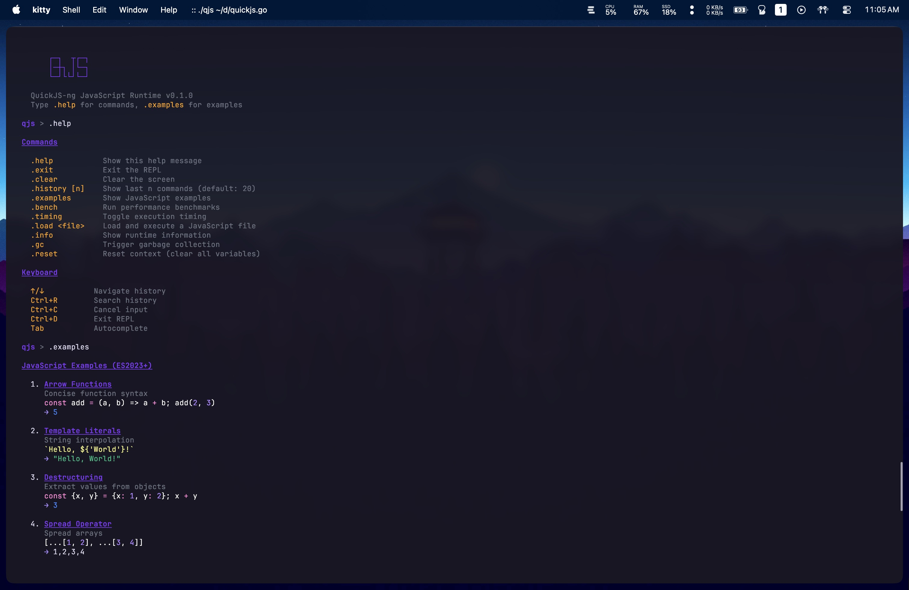

# quickjs

CGO-free Go bindings for QuickJS-ng, a modern ES2023+ JavaScript engine.

Uses WebAssembly and [wazero](https://wazero.io/) for pure Go execution without any C dependencies.



## Features

- No CGO required
- ES2023+ support (classes, async/await, Promises, BigInt, modules)
- Cross-platform (Linux, macOS, Windows, any platform wazero supports)
- Thread-safe
- Go function bindings
- Full type support (primitives, objects, arrays, functions)

## Installation

```bash
go get github.com/Gaurav-Gosain/quickjs
```

Requires Go 1.21 or later.

## Usage

```go
package main

import (
    "fmt"
    "log"

    "github.com/Gaurav-Gosain/quickjs"
)

func main() {
    rt, err := quickjs.NewRuntime()
    if err != nil {
        log.Fatal(err)
    }
    defer rt.Close()

    ctx, err := rt.NewContext()
    if err != nil {
        log.Fatal(err)
    }
    defer ctx.Close()

    result, err := ctx.Eval("1 + 2")
    if err != nil {
        log.Fatal(err)
    }

    fmt.Println(result.String()) // 3
}
```

## Go Function Bindings

```go
fn := ctx.Function("add", func(ctx *quickjs.Context, this quickjs.Value, args []quickjs.Value) quickjs.Value {
    a, _ := args[0].Int32()
    b, _ := args[1].Int32()
    return ctx.Int32(a + b)
})
ctx.SetGlobal("add", fn)

result, _ := ctx.Eval("add(2, 3)")
fmt.Println(result.String()) // 5
```

## Objects

```go
obj := ctx.Object()
obj.Set("name", ctx.String("Alice"))
obj.Set("age", ctx.Int32(30))
ctx.SetGlobal("person", obj)

result, _ := ctx.Eval("person.name + ' is ' + person.age")
fmt.Println(result.String()) // Alice is 30
```

## Error Handling

```go
result, err := ctx.Eval("throw new Error('failed')")
if err != nil {
    fmt.Println("Error:", err)
}

result, err = ctx.Eval("syntax error {")
if err != nil {
    fmt.Println("Syntax error:", err)
}
```

## Concurrency

The library is thread-safe. Multiple goroutines can use the same runtime:

```go
rt, _ := quickjs.NewRuntime()
defer rt.Close()

var wg sync.WaitGroup
for i := range 10 {
    wg.Add(1)
    go func(n int) {
        defer wg.Done()
        ctx, _ := rt.NewContext()
        defer ctx.Close()
        result, _ := ctx.Eval(fmt.Sprintf("%d * %d", n, n))
        fmt.Printf("%d^2 = %s\n", n, result.String())
    }(i)
}
wg.Wait()
```

## API

### Runtime

```go
rt, err := quickjs.NewRuntime()
rt.Close() error
rt.NewContext() (*Context, error)
rt.RunGC() error
rt.SetMemoryLimit(limit uint32) error
```

### Context

```go
ctx.Eval(code string) (Value, error)
ctx.EvalFile(filename string) (Value, error)
ctx.Close() error

// Value constructors
ctx.Null() Value
ctx.Undefined() Value
ctx.Bool(v bool) Value
ctx.Int32(v int32) Value
ctx.Int64(v int64) Value
ctx.Float64(v float64) Value
ctx.String(v string) Value
ctx.Object() Value
ctx.Array() Value
ctx.Error(msg string) Value
ctx.Function(name string, fn GoFunc) Value

// Globals
ctx.Global() (Value, error)
ctx.SetGlobal(name string, value Value) error
```

### Value

```go
// Type checking
v.IsNull() bool
v.IsUndefined() bool
v.IsBool() bool
v.IsNumber() bool
v.IsString() bool
v.IsObject() bool
v.IsArray() bool
v.IsFunction() bool
v.IsError() bool

// Conversion
v.Bool() (bool, error)
v.Int32() (int32, error)
v.Int64() (int64, error)
v.Float64() (float64, error)
v.String() string
v.Len() int

// Object/Array access
v.Get(key string) (Value, error)
v.Set(key string, value Value) error
v.GetIdx(idx int) (Value, error)
v.SetIdx(idx int, value Value) error

// Function calls
v.Call(thisArg Value, args ...Value) (Value, error)
```

## Benchmarks

```bash
go test -bench=. -benchmem
```

## Examples

See the `examples/` directory:

- `basic` - Basic evaluation and types
- `gofunc` - Go function bindings
- `json` - JSON parsing
- `es6` - ES6+ features
- `objects` - Object manipulation
- `errors` - Error handling
- `concurrent` - Concurrent usage

## REPL

```bash
go run ./cmd/qjs
```

## Requirements

- Go 1.21+
- No CGO (pure Go)
- No external dependencies beyond wazero

## Limitations

- TinyGo is not supported (wazero requires syscall interfaces not available in TinyGo)

## License

MIT
